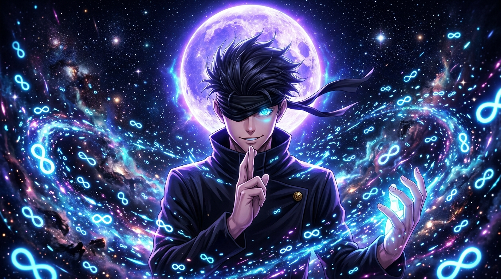

# 🌌 MOON_VIEW — 3D Animated Anime Wallpaper Vault

<div align="center">



**Step into another dimension with next-gen 3D parallax depth, glowing celestial moon aesthetics, and ultra-high-definition 8K anime wallpapers.**

[](https://vitejs.dev/)
[](https://developer.mozilla.org/en-US/docs/Web/JavaScript)
[](https://www.w3.org/Style/CSS/)
[](LICENSE)

[✨ Features](#-features) • [🚀 Quick Start](#-quick-start) • [📁 Project Structure](#-project-structure) • [🎨 Wallpaper Roster](#-wallpaper-roster) • [⌨️ Keyboard Shortcuts](#️-keyboard-shortcuts) • [📖 Documentation](#-documentation-folder)

</div>

---

## 🌟 Overview

**MOON_VIEW** is an ultra-premium, interactive 3D anime wallpaper vault. Built with modern Vanilla JS and Vite, it delivers breathtaking visual fidelity, real-time procedural starfields with glowing celestial moons, dynamic 3D tilt and mouse parallax, audio-visual feedback, and one-click downloads in multi-tier resolutions (8K Master, 4K UHD, 1080p, Ultrawide, and Mobile 9:16).

---

## ✨ Features

- 🌌 **Interactive 3D Cosmic Space Engine**: Procedural starfield particle system, nebula fog, orbiting space dust, shooting stars, and a dynamic glowing moon canvas.
- 🎴 **3D Depth Holographic Parallax Cards**: Smooth interactive cursor tilt, lighting specular highlights, and 3D layered elevation.
- 🔍 **Global Quick Search (Command Palette)**: Trigger with `Ctrl + K` / `Cmd + K` or `/` to instantly search anime titles, characters, and tags.
- 🎨 **Accent Theme Customizer**: Switch theme aesthetics dynamically (Cyan Cyber, Violet Nebula, Crimson Blood, Gold Solar, Emerald Glitch).
- 🔊 **Haptic Audio Feedback**: Ambient synthesizer soundscape and futuristic UI sound effects (toggleable).
- 📥 **Universal Multi-Resolution Downloader**: Simulated and real high-resolution asset export with custom aspect ratio scaling.
- 💖 **Favorites & Collection Vault**: Save wallpapers to local storage collection with heart reaction animations.
- 👤 **Interactive User Dashboard & Auth**: Profile stats, download history, theme preference manager, and custom upload modal.

---

## 🚀 Quick Start

### 1. Prerequisites
Ensure you have [Node.js](https://nodejs.org/) installed (v18+ recommended).

### 2. Clone the Repository
```bash
git clone https://github.com/sougatasmp69-jpg/MOON_VIEW.git
cd MOON_VIEW
```

### 3. Install Dependencies
```bash
npm install
```

### 4. Start Development Server
```bash
npm run dev
```
Open your browser and navigate to:
👉 **`http://localhost:5173/`**

### 5. Build for Production
```bash
npm run build
```
The optimized bundle will be generated inside the `dist/` directory.

### 6. Preview Production Build
```bash
npm run preview
```

---

## 📁 Project Structure

```
project 3/
├── index.html               # Main entry HTML file
├── package.json             # NPM dependencies and scripts
├── vite.config.js           # Vite build and asset configuration
├── .gitignore               # Git ignore rules
│
├── public/                  # Static assets
│   ├── avatars/             # User profile avatars (SVG)
│   └── wallpapers/          # High-resolution anime wallpapers (JPG/SVG)
│
├── src/                     # Application source code
│   ├── main.js              # Application bootstrapper and router
│   ├── components/          # Reusable UI & canvas components
│   │   ├── CardTilt.js          # 3D mouse parallax card tilt controller
│   │   ├── CosmicBackground.js  # 3D canvas starfield & moon particle engine
│   │   ├── Footer.js            # Global footer component
│   │   ├── Navbar.js            # Navigation bar with search & theme picker
│   │   ├── QuickSearchModal.js  # Command palette search modal
│   │   └── Toast.js             # Toast notification engine
│   ├── data/
│   │   └── wallpapers.js    # Comprehensive wallpaper catalog database
│   ├── services/
│   │   ├── audio.js             # Web Audio API futuristic sound synthesizer
│   │   ├── downloader.js        # Resolution scaling & download manager
│   │   └── store.js             # Reactive state store with local persistence
│   ├── styles/
│   │   ├── variables.css    # CSS design tokens, colors & themes
│   │   ├── main.css         # Reset, typography, layout & animations
│   │   └── components.css   # Component styles (cards, modals, badges)
│   ├── utils/
│   │   └── assets.js        # Dynamic asset URL resolution helper
│   └── views/
│       ├── HomeView.js      # Hero showcase & trending wallpapers
│       ├── BrowseView.js    # Filterable grid by universe, tags & sort
│       ├── DetailView.js    # 3D preview, specs, reviews & downloads
│       ├── AuthView.js      # Login and registration view
│       └── DashboardView.js # User profile, favorites & statistics
│
└── readme/                  # Detailed documentation folder
    ├── ARCHITECTURE.md      # Application architecture & state flow
    ├── GUIDE.md             # Complete user and developer guide
    └── WALLPAPERS.md        # Wallpaper universe catalog & specifications
```

---

## 🎨 Wallpaper Roster

| Universe | Character | Wallpaper Title | Default Res |
| :--- | :--- | :--- | :--- |
| **Jujutsu Kaisen** | Satoru Gojo | *Infinite Void // Cosmic Horizon* | 8K Master |
| **Demon Slayer** | Tanjiro Kamado | *Hinokami Kagura // Solar Dragon* | 8K Master |
| **Solo Leveling** | Sung Jin-Woo | *Shadow Monarch // Arise* | 8K Master |
| **One Piece** | Monkey D. Luffy | *Gear 5 Sun God // Lunar Laughter* | 8K Master |
| **Attack on Titan** | Eren Yeager | *Founding Titan // Rumbling Dawn* | 8K Master |
| **Cyberpunk: Edgerunners** | Lucy Kushinada | *Moon Dream // Neon Starlight* | 8K Master |
| **Jujutsu Kaisen** | Ryomen Sukuna | *Malevolent Shrine // Blood Domain* | 4K UHD |
| **Bleach: TYBW** | Ichigo Kurosaki | *Bankai Tensa Zangetsu // Getsuga Tensho* | 4K UHD |
| **Naruto Shippuden** | Naruto Uzumaki | *Kurama Six Paths Sage Mode* | 4K UHD |
| **Chainsaw Man** | Denji | *Chainsaw Devil Hybrid // Blood Spark* | 4K UHD |
| **Demon Slayer** | Zenitsu Agatsuma | *Thunder Breathing // God Speed* | 4K UHD |
| **Naruto Shippuden** | Itachi Uchiha | *Tsukuyomi Blood Moon // Crow Genjutsu* | 4K UHD |
| **Attack on Titan** | Levi Ackerman | *Beast Titan Slayer // Spiral Blade* | 4K UHD |
| **Jujutsu Kaisen** | Megumi Fushiguro | *Chimera Shadow Garden // Mahoraga* | 4K UHD |

---

## ⌨️ Keyboard Shortcuts

| Shortcut | Action |
| :--- | :--- |
| <kbd>Ctrl</kbd> + <kbd>K</kbd> / <kbd>Cmd</kbd> + <kbd>K</kbd> | Open Global Quick Search Modal |
| <kbd>/</kbd> | Instant Search |
| <kbd>Esc</kbd> | Close Modal / Return to Previous View |
| <kbd>Alt</kbd> + <kbd>H</kbd> | Navigate to Home |
| <kbd>Alt</kbd> + <kbd>B</kbd> | Navigate to Browse Wallpapers |
| <kbd>Alt</kbd> + <kbd>D</kbd> | Open User Dashboard |

---

## 📖 Documentation Folder

For in-depth technical guides, explore the [`readme/`](./readme/) folder:
- 🏗️ [Architecture & Reactive State Flow](readme/ARCHITECTURE.md)
- 🎮 [User & Developer Guide](readme/GUIDE.md)
- 🌌 [Wallpaper Universe Catalog & Spec](readme/WALLPAPERS.md)

---

## 🛠️ Tech Stack & Libraries

- **Build Tool:** [Vite 5](https://vitejs.dev/)
- **Core Engine:** Vanilla JavaScript (ES Modules)
- **Styling:** Custom Vanilla CSS with Glassmorphism, CSS Custom Properties & GPU-accelerated transforms
- **Effects & UI:**
  - [Lucide Icons](https://lucide.dev/) (Iconography)
  - [Canvas-Confetti](https://www.npmjs.com/package/canvas-confetti) (Celebratory micro-interactions)
  - Custom Web Audio Synthesizer (Ambient soundscape)
  - HTML5 Canvas 2D / 3D Space Engine

---

## 📜 License

Distributed under the MIT License. See `LICENSE` for more information.

<div align="center">
  <sub>Crafted with 💜 for anime enthusiasts and cosmic aesthetic lovers.</sub>
</div>
